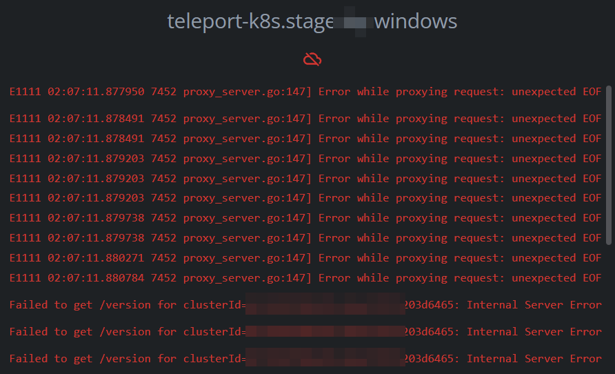
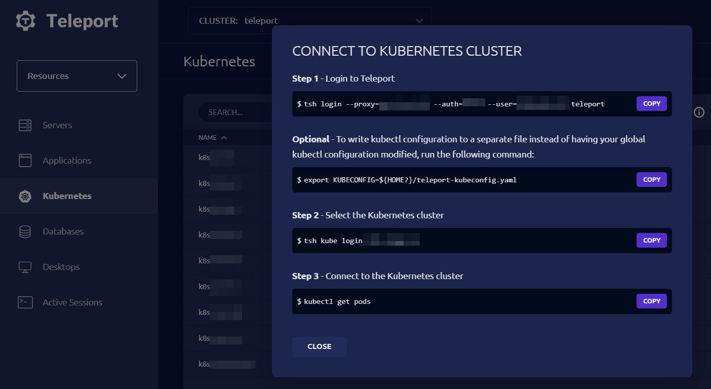
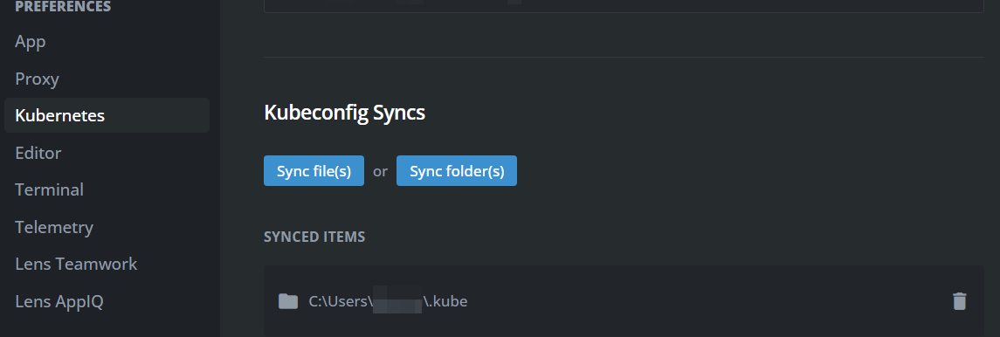

# Как подружить Windows, Lens и Teleport

Тэги: #windows #lens #teleport #tsh #kubernetes

Если вы как я, и все остальные "нетрушные" программисты не спешите уходить с Windows на Linux или Mac, а встроенный WSL2 вас белее чем устраивает, то вы как раз по адресу.
Я не являюсь экспертом ни в одном из этих сервисов, но в какой-то момент моей разработческой жизни возникла необходимость подключиться к кластеру Kubernetes с помощью Lens, т.к. не могу сказать, что пользоваться kubectl очень удобно. Подробной инструкции на этот счет, к сожалению, в Интернете мне найти не удалось. Поэтому решил написать свою.
Забегая вперед, скажу, что моя главная ошибка была в том, что для Lens я пытался использовать конфиг Kubernetes, который лежал в директории WSL2. Почему? Потому что думал, что Lens может взаимодействовать с WSL2 также, как Docker Desktop. Но (шок контент) это оказалось не так. Внятного объяснения этому я найти не смог, но основной совет:  не пытайтесь так делать (или пытайтесь и, если у вас получилось, напишите в комментах). Не смотря на отсутствие различий в конфигурациях, Lens работал только с тем конфигом, который лежал в директории Windows.


Итак, разберем все по шагам:

1. Для работы с прокси Teleport вам понадобится утилита `tsh`. Та, которую вы, возможно, уже установили в WSL2 не пойдет, нужно будет установить утилиту для Windows. Инструкция доступна на официальном сайте, но я также продублирую ее здесь.
   Для установки `tsh`в Windows выполните следующие команды в **PowerShell** (эти команды не будут работать в Windows `cmd.exe`):
   Установите уровень TLS на TLS 1.2 (требуется в Windows Server 2016 и более ранних версиях).
```
[Net.ServicePointManager]::SecurityProtocol = [Net.SecurityProtocolType]::Tls12
```
Получите ожидаемую контрольную сумму для пакета Windows tsh.
Версия клиента `teleport` должна быть не ниже, чем установлена на сервере!
```
$Resp = Invoke-WebRequest https://get.gravitational.com/teleport-v14.1.1-windows-amd64-bin.zip.sha256
```
PowerShell вернет двоичное представление содержимого ответа по умолчанию, поэтому вам нужно преобразовать его в строку
```
[System.Text.Encoding]::UTF8.getstring($Resp.Content)
```
	`<контрольная сумма> <имя файла>
```
Invoke-WebRequest -OutFile teleport-v14.1.1-windows-amd64-bin.zip -Uri https://cdn.teleport.dev/teleport-v14.1.1-windows-amd64-bin.zip
certUtil -hashfile teleport-v14.1.1-windows-amd64-bin.zip SHA256
```
SHA256 hash of teleport-v14.1.1-windows-amd64-bin.zip:
`<контрольная сумма>`
CertUtil: -hashfile command completed successfully.

После того, как вы убедились в совпадении контрольных сумм, вы можете извлечь архив. Исполняемый файл будет доступен по адресу `teleport-v14.1.1-windows-amd64-bin\teleport\tsh.exe`
```
Expand-Archive teleport-v-v14.1.1-windows-amd64-bin.zip
cd teleport-v14.1.1-windows-amd64-bin\teleport
.\tsh.exe version
```
Обязательно переместите tsh.exe в свой PATH, чтобы использовать короткую команду `tsh`, вместо необходимости каждый раз указывать путь к исполняемому файлу.

После установки tsh перейдите на страницу вашего Teleport и выполните действия в командной строке согласно указанным инструкциям. 

2. Скачайте и установите Lens с официального сайта. После установки откройте Lens. Выберите `"настройки" (иконка "бургер меню") -> file -> preferences`, чтобы установить файл  или папку, откуда Lens будет читать конфиг Kubernetes. и выберите опцию "Add Cluster". 


В указанной директории должен лежать конфиг примерно такого содержания:

```yml
apiVersion: v1
clusters:
- cluster:
    certificate-authority-data: ${CLUSTER_CA}
    server: ${TELEPORT_ENDPOINT}
    tls-server-name: ${TELEPORT_ENDPOINT} 
  name: ${CLUSTER_NAME}
contexts:
- context:
    cluster: ${CLUSTER_NAME}
    user: ${USER_NAME}
  name: ${CONTEXT_NAME}
current-context: ${CONTEXT_NAME}
kind: Config
preferences: {}
users:
- name: ${USER_NAME}
  user:
    exec:
      apiVersion: client.authentication.k8s.io/v1beta1
      args:
      - kube
      - credentials
      - --kube-cluster=${KUBE_CLUSTER}
      - --teleport-cluster=${CLUSTER_NAME}
      - --proxy=${TELEPORT_HOST}:${TELEPORT_PORT}
      command: C:\Users\user\teleport-v12.4.23-windows-amd64-bin\teleport\tsh.exe
      env: null
      provideClusterInfo: false
```

Если у вас уже настроен доступ к Kubernetes из вашего WSL2, можно скопировать конфиг оттуда, заменив только `command` для вызова вашего tsh-клиента.

Теперь у вас должен быть доступ к вашему кластеру Kubernetes через Lens, где вы сможете просматривать, управлять и анализировать ресурсы кластера, а также работать над вашими приложениями. Не забывайте делать коннект к tsh после каждой перезагрузке системы. Думаю, это очевидно, но мало ли 😄

Обратите внимание, что для работы с Kubernetes через прокси Teleport вам необходимо иметь соответствующие права доступа в Teleport. Если у вас нет таких прав, обратитесь к администратору системы.
